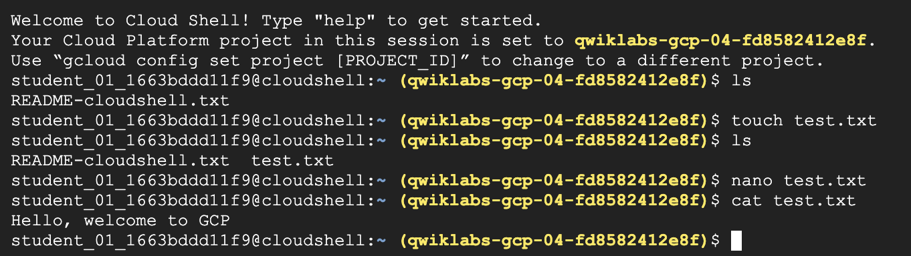

# Lab1 - Complete QwikLabs tour of Google Cloud Platform

You should access the QwikLabs tour and Google Cloud Platform (GCP)
overview at [https://www.qwiklabs.com/focuses/2794?parent=catalog](https://www.qwiklabs.com/focuses/2794?parent=catalog).

This lab should be very easy -- you're basically following an online
tutorial to learn how to use a software platform. Some additional
challenges will be that you're going to be accepting this lab through
Github Classroom and submitting your solution using git.

While the QwikLabs system will provide Google Compute credits for the
labs, you should go ahead and accept the Google Credits first so that
the QwikLabs are free as well.

You should complete that lab and then upload the image of your
test.txt file, similar to the one below:

You should name your image something like
"lab1-finish-YOURNAME.png". You should then modify this README.md to
display your image rather than the image I provided. This will
evaluate your ability to:

* Complete the Qwiklab on using Google cloud
* Accepting a Github Classroom assignment
* Checkout out a Git repo
* Adding a file to the staging (`git add your-file-name.png`)
* Updating a Markdown file
* Commiting your changes (`git commit -a -m'your message here'`)
* Pushing the changes to Github (`git push`)

