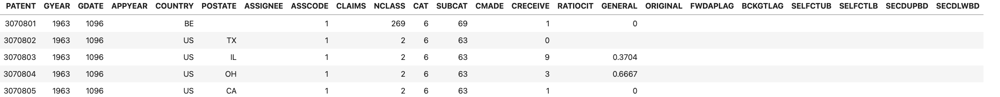
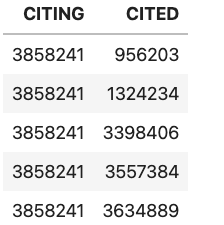

[](https://classroom.github.com/online_ide?assignment_repo_id=8478198&assignment_repo_type=AssignmentRepo)
# Assignment #3 - Complex Joins using SQL

## Objectives:

This lab is designed to have you do a complex "join" using SQL. The goal of this assignmwnt is understand how *joins* play a common role in many data analysis problems. In the past, I've had students solve this problem using Hadoop and then using Spark;
Hadoop is (rightfully) becoming less important so we're going to solve it using SQL and then solve it using Spark.

It's difficult to implement joins in Hadoop manually
so I'm going to walk through a solution using Hadoop in class, 
but you'll be asked to produce a single SQL query that produces 
the desired output below. You will then be asked to implement it in Spark using RDD's and then using SparkSQL.

## Datasets

You will use the description of the
`acite75_99.zip` and `pat63_99.txt` files (see
[http://data.nber.org/patents](http://data.nber.org/patents) for documentation).

The `Makefile` in this repository should include steps to retrieve the `acite75_99.zip`
and `pat63_99.txt` files; [starter code](Lab03-sqlite-patent.ipynb) includes
code that creates an Sqlite3 database named `patents.sq3` that will contain both database.

The `pat63_99.txt` file contains the patent number, an (optional)
state in which the patent is filed and the total number of citations
made.



The `acite75_99.txt` file contains a citation index, of the form



where both CITING and CITED are integers representing patent numbers. Each line
indicates that patent number CITING cites patent CITED.


Your job is augment the data in
patent data to include a column indicating the number of patents
  cited that originate from the same state. Obviously, this data can
  only be calculated for patents that have originating state information
  and only for cited patents that provide that information.

To do this, you will first need do a "data join” of the citations and the patent data - for each cited patent, you'll need to determine the state of the cited patent.

See [the starter code](Lab03-sqlite-patent.ipynb) for more details.

## What and how to turn in your work

You should turn in your work by commiting your changes to starter code ( Lab03-sqlite-patent.ipynb ) and check it in. You can do this using:
```
git commit -a -m'final version'
git push
```

Your should **NOT** add the `patents.sq3` database file to your git repo -- in other words,
do NOT do something like:
```
git add *
git commit -m'you just made a huge mistake'
```
If you do this, you will have checked a huge file into your Git repo and you won't be able
to push it to github. If you make this mistake [you can fix it yourself](https://medium.com/analytics-vidhya/tutorial-removing-large-files-from-git-78dbf4cf83a).