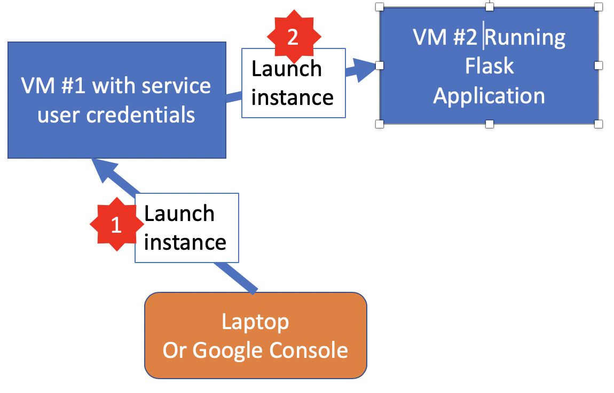
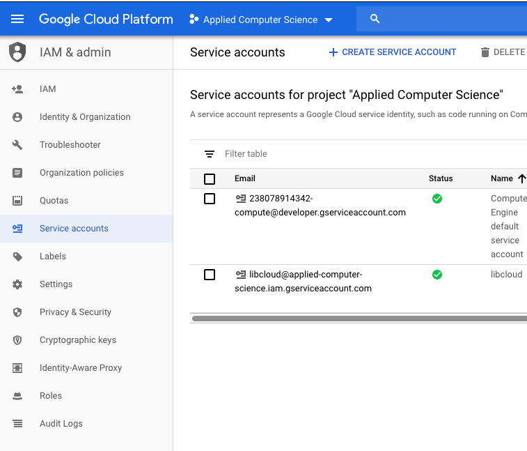
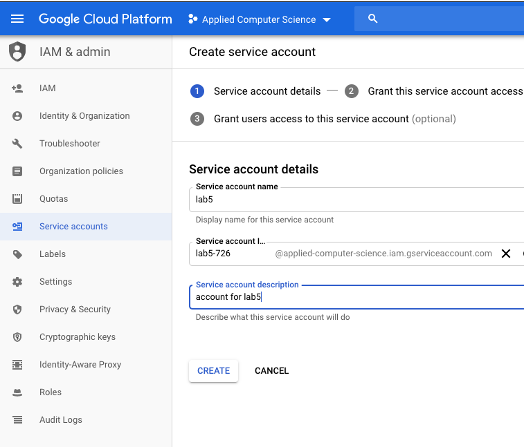
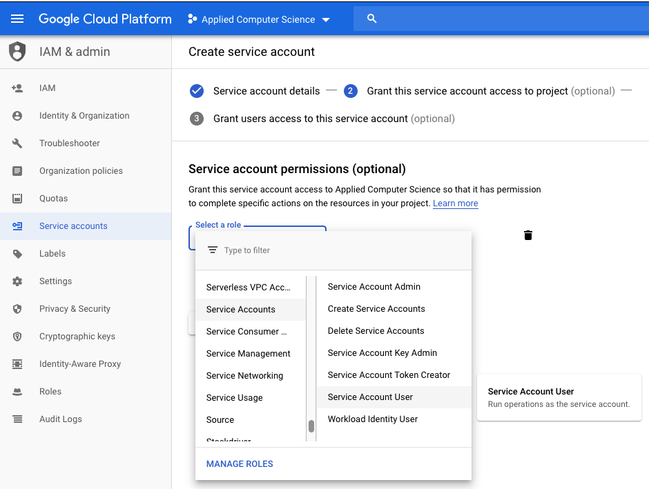
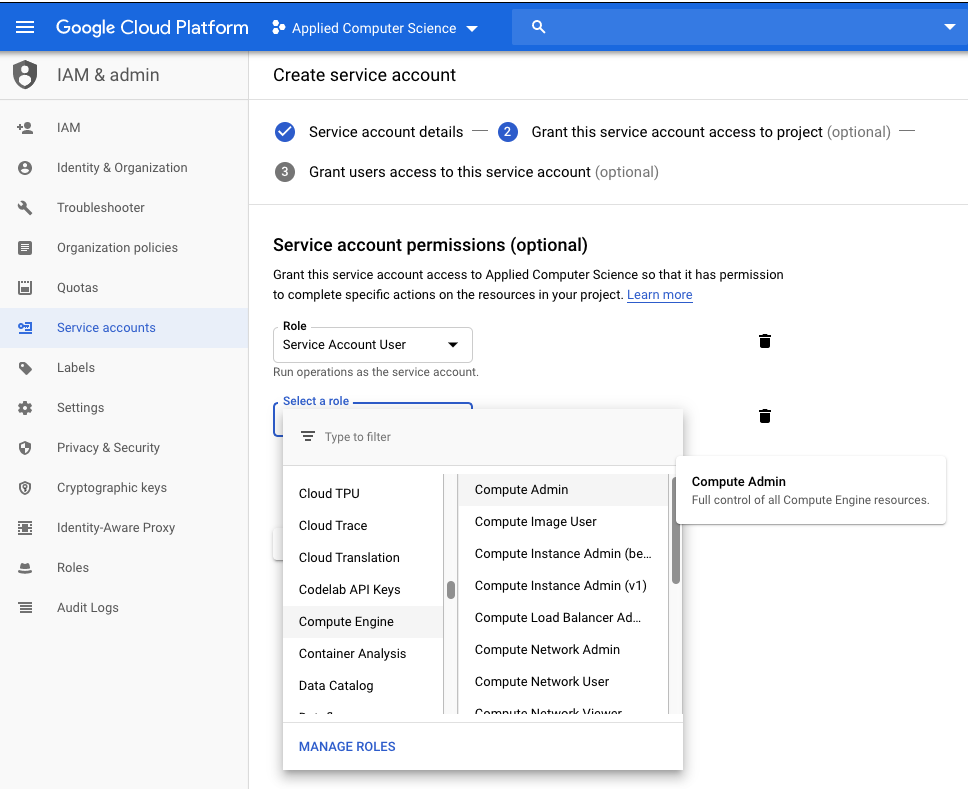
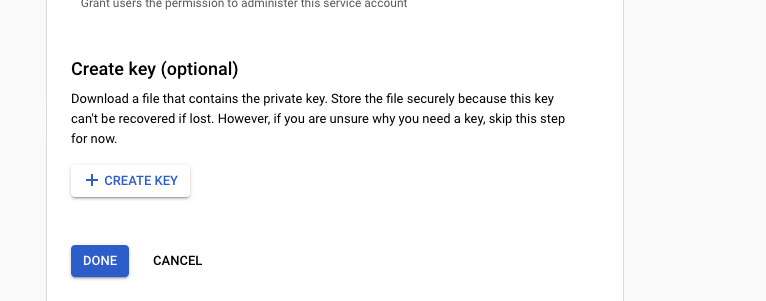

# Part3 - Creating VM using a VM

In this task, you're going to create a program that runs in a VM
and still create virtual machines, just as in your first example.
The challenge is that the first VM needs to authenticate itself
to Google Cloud in order to create VM's. Let's look at this diagramtically
using the following figure:



When you're using your laptop or Google Cloud Console to create VM's,
authentication information is automatically retrieved and sent to Google
as part of the API requests that describe what rights and permissions you have.
In this scenario, you will use your laptop to create a VM (step 1) that
will then launch another VM (step 2) that has the Flask application.
The launching VM created in step 1 needs to directly authenticate to Google
when it tries to launch the Flask application. 

There are two ways to do this:
* Setting the `serviceAccounts` property in the parameters for `compute.instances().insert()` which 
  creates a temporary service account for this instance.
* Creating an explicit [service account](https://google-auth.readthedocs.io/en/latest/reference/google.oauth2.service_account.html#module-google.oauth2.service_account).
A service account is like a "password" that can be used to access your google cloud API without you having
to directly authenticate.

### Passing data to VM-1

You will need to provide several bits of data to VM-1 in order to launch VM-2.
In particular, you need to provide VM-1 the program uses to launch VM-2,
you need the provide VM-1 the startup script that it will provide to VM-2 so that VM-2 can start running your blog,
and you may need to provide other information such as credentials (see below).
Previously, when creating an instance, you set up the single `startup-script` property.
By default, the instance executes this shell script when the VM is launched.
This is specified by attributes like these:
```
        # Metadata is readable from the instance and allows you to
        # pass configuration from deployment scripts to instances.
        'metadata': {
            'items': [{
                # Startup script is automatically executed by the
                # instance upon startup.
                'key': 'startup-script',
                'value': startup_script
            }
            ]
        }
    }
```
where `startup-script` is a string containing the startup shell script.

Google cloud (and all other cloud providers) have general mechanisms for [storing and retrieving metadata](https://cloud.google.com/compute/docs/storing-retrieving-metadata).
This involves using a "link local address" for a "fake" web server at address `169.254.169.254`.
Cloud providers usually provide a hostname such as `metadata` for this address.

For example, you could download the `startup-script` metadata using
```
curl http://metadata/computeMetadata/v1/instance/attributes/startup-script -H "Metadata-Flavor: Google" > startup-script.sh
```
This is how your `startup-script` is actually downloaded in order to be executed.

You can store other metadata attributes and then retrieve them on your created VM.
The `items` are a list of Python dictionaries that contain entries for `key` and `value`.

You can retrieve a specific key using an HTTP get request. For example, if you set provide a `vm2-script` that is passed to VM-1,
you could store it using...
```
        # Metadata is readable from the instance and allows you to
        # pass configuration from deployment scripts to instances.
        'metadata': {
            'items': [{
                # Startup script is automatically executed by the
                # instance upon startup.
                'key': 'startup-script',
                'value': startup_script
            },
               { 'key' : 'vm2-script', 'value' : vm2ScriptAsString }
            ]
        }
    }
```
and retrieve that on VM-1 using
```
curl http://metadata/computeMetadata/v1/instance/attributes/vm2-script -H "Metadata-Flavor: Google" > vm2-script.sh
```

I found it useful to transfer multiple files over to VM1 and retrieve them using, e.g.
```
mkdir -p /srv
cd /srv
curl http://metadata/computeMetadata/v1/instance/attributes/vm2-startup-script -H "Metadata-Flavor: Google" > vm2-startup-script.sh
curl http://metadata/computeMetadata/v1/instance/attributes/service-credentials -H "Metadata-Flavor: Google" > service-credentials.json
curl http://metadata/computeMetadata/v1/instance/attributes/vm1-launch-vm2-code -H "Metadata-Flavor: Google" > vm1-launch-vm2-code.py
export GOOGLE_CLOUD_PROJECT= $(curl http://metadata/computeMetadata/v1/instance/attributes/project -H "Metadata-Flavor: Google")

pip3 install --upgrade google-api-python-client google-auth-httplib2 google-auth-oauthlib
python3 ./vm1-launch-code.py
```

Note that if there's a problem and you need to debug things, you'll have to log into your
VM-1 instance, go the appropriate directory (`/srv` in my example) and debug from there
so see why VM-2 isn't getting launched. **N.B.** The code shown above has two errors and I
lost 40 minutes of my life because I didn't check things carefully. Don't make the same mistake!

### Creating an explicit service account
Knowing how to use service accounts is important if you're trying to create services that manage your cloud environment when you're not around. 
To use an explicit service account you need to:
* Create the service account
* Give it specific permissions (e.g. ability to create a VM)
* Get the key credentials so your program can use them

We'll show you the steps needed to create a service account below
there is a program interface for this do this but we'll cheat and use  the
Google console.

Once you have your credentials file (this will be a JSON file), we need to provide
it to Google for authentication. The write up for the `google.auth` library explains service accounts,
and there's also a writeup [the google cloud documentation](https://cloud.google.com/iam/docs/understanding-service-accounts).

The code stub in `part3.py` uses the `google.oauth` library to authenticate using
credentials stored in a file called `service-credentials.json`. You can use those
credentials to launch the first VM. You should use `part3.py` to create a VM and provide the service credentials to that VM (step 1). 
That first VM **must** have a copy of the service-credential file 
on the VM when it is running because it will need those credentials to launch the second VM;
alternatively, if you set the `serviceAccounts` property you would not need the explicit service account credentials.

The `startup_script` for that first VM will create the *second* VM that will run the `flask`
application as before. That startup script will run a Python program that then starts the
second VM, but that python program (running on the first VM) needs to have the credentials to be successful.

**N.B. security** - The second VM does not need access to the service credentials, and in general
you want to be careful in sharing or exposing those credentials. If someone else had them, they could create VM's, 
networks and so on just as you could. The benefit of service accounts is you can then restrict their abilities,
limiting them to the specific API routines needed. 

This is why using the `serviceAccounts` property
is arguably a better practice (there's no file to steal), but we want you to know how to use both.
For example, setting the `serviceAccounts` property is fine when
the program accessing Google cloud is running **in** Google Cloud, but
you may want a program to run on some other computer to *e.g.* monitor your
Google cloud instances. In that case, you'd need to have the service credentials
file in order to access the services.

## Creating your service account
Follow the steps below to create a service account and then save the resulting JSON credentials into a file
called `service-credentials.json`

### Go to the Google Console IAM service


### Then create an account


### Then set it as a serviceAccountUser


### Then compute admin


### Then create the key and save the JSON file
